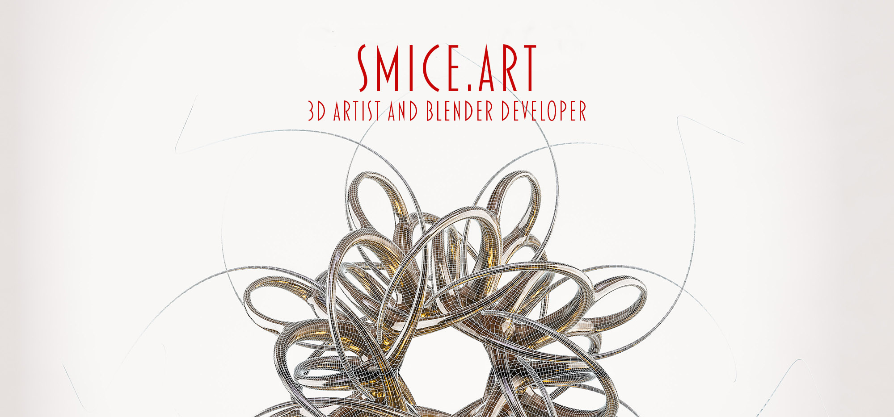
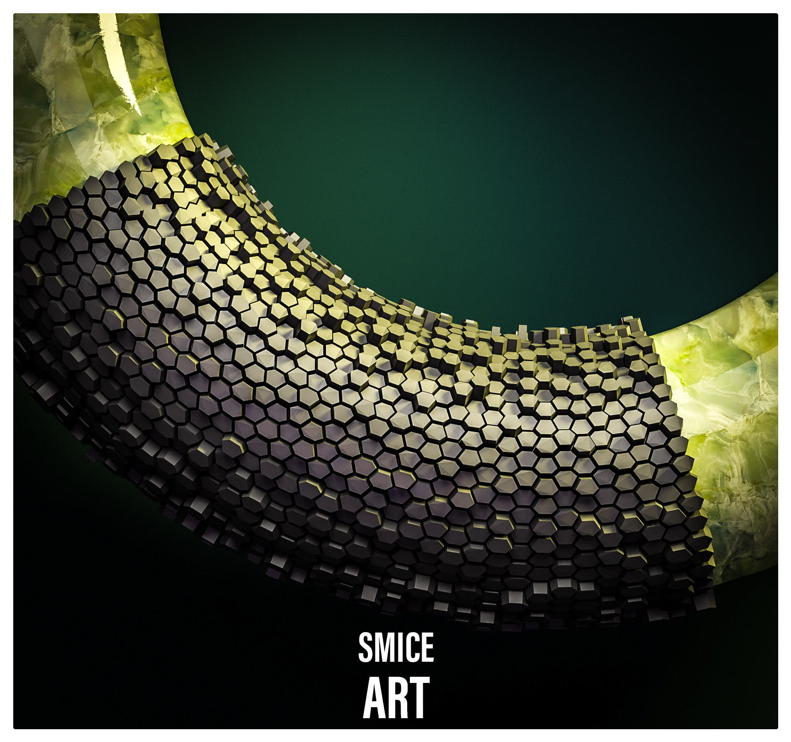
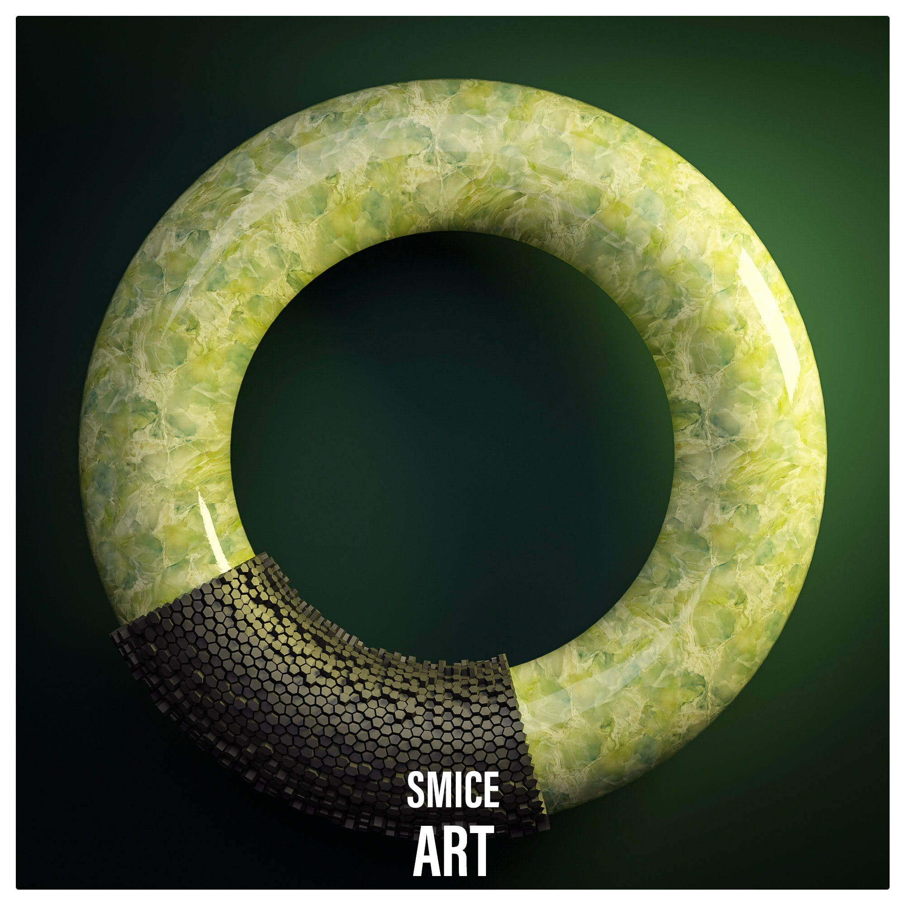
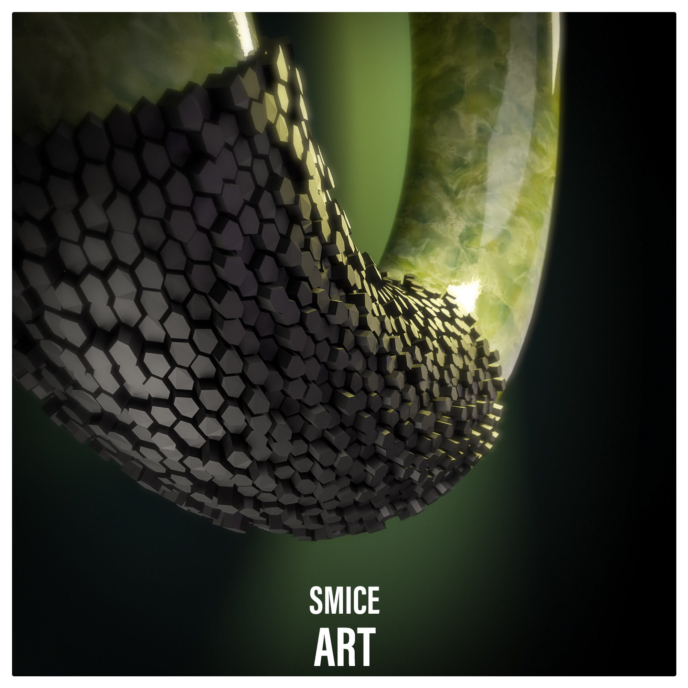
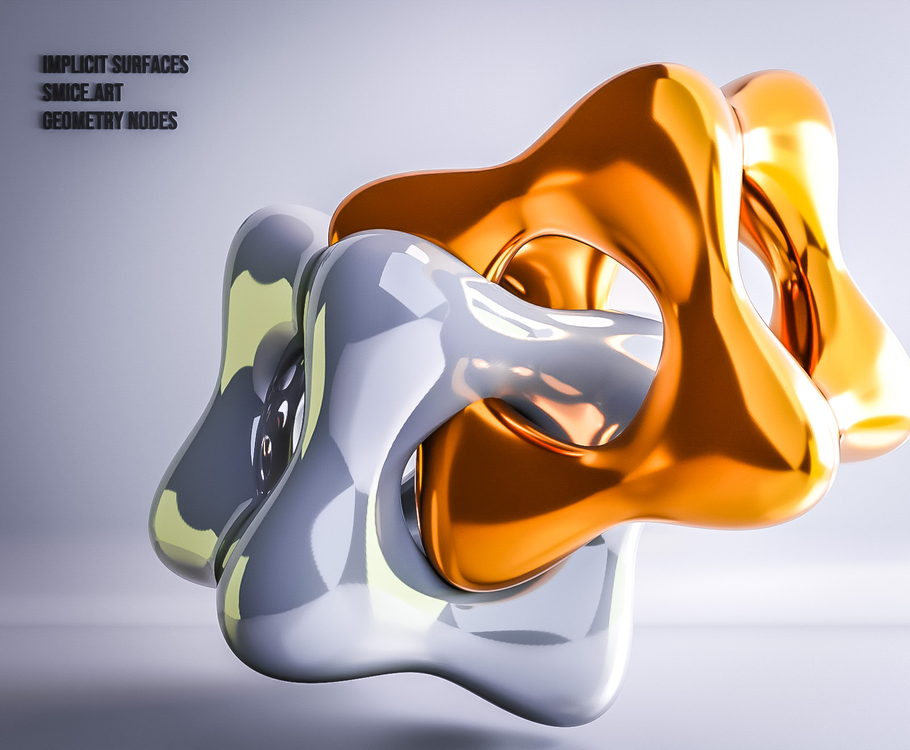
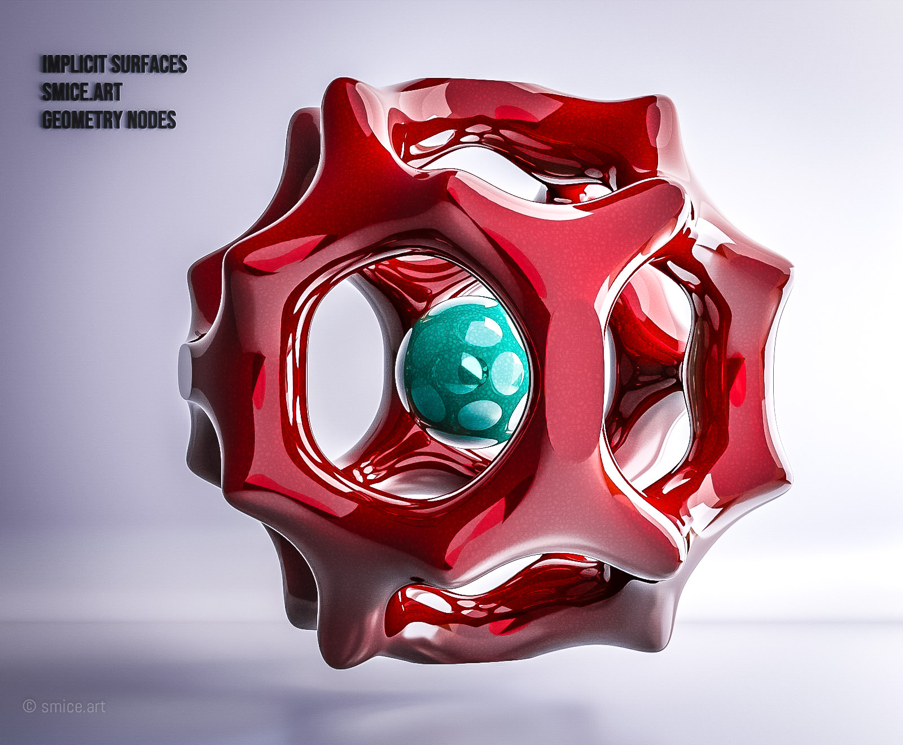
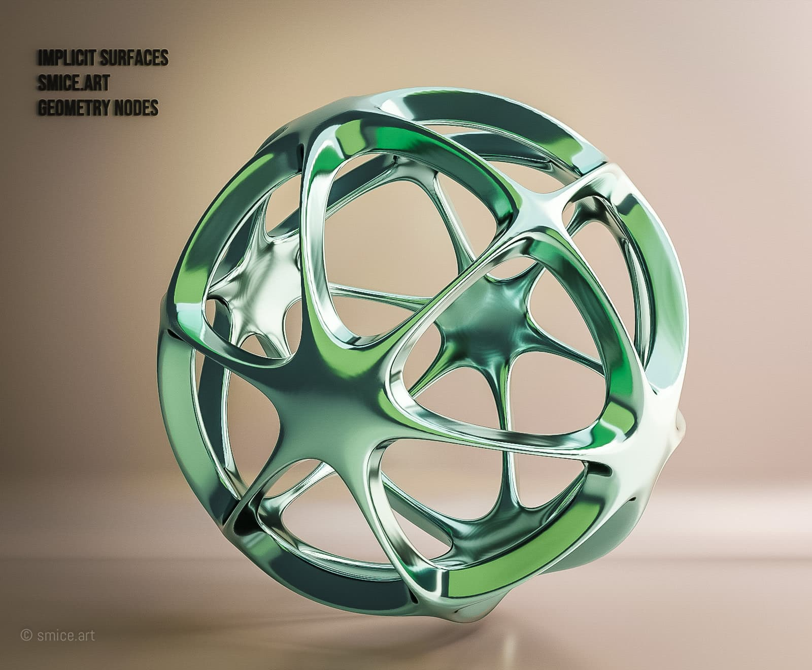
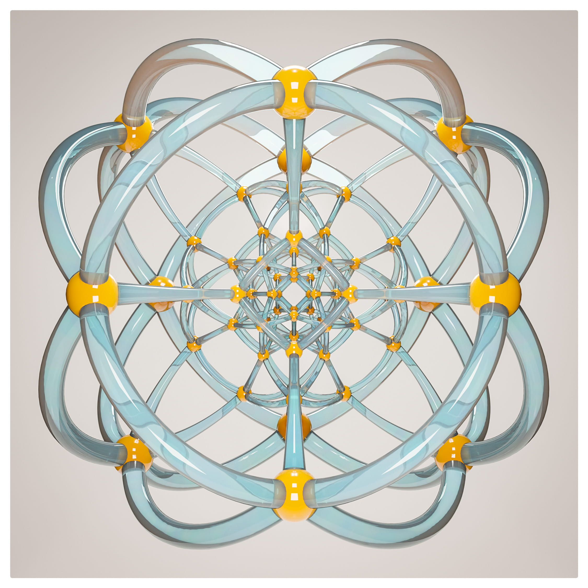
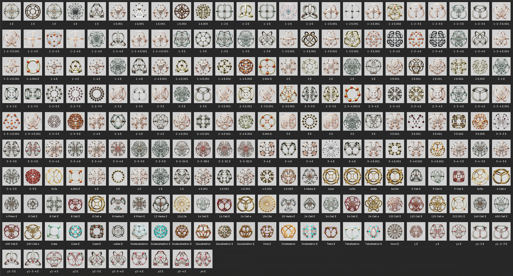

  

## Hi there! I'm Claudio 👋 3D Artist & Developer

### 🧑‍🎨 About Me
I am a 3D Artist with a great affection for mathematical 3D shapes. Everything here revolves around software-based Digital Art, created with Blender and Python scripts. Even though all my projects have a mathematical basis, I am primarily an artist, not a mathematician. Therefore, it's quite possible that my explanations aren't mathematically correct. Please excuse me for that.

### 💬 I’m currently... 
....working on this GitHub space

### 👁️‍🗨️ Connect with me
 Smice
  <li><a href="https://sketchfab.com/smice" target="_blank">👁️‍🗨️ Sketchfab</a></li>
  <li><a href="https://superhivemarket.com/creators/smice" target="_blank">👁️‍🗨️ Superhive Market</a></li>

### ⚙️ Featured Blender Add-ons & Scripts
* ⚙️ Reverse-Baking– A Blender add-on that reverses the texture baking pipeline.
* ⚙️ Blender-Auto-Animation – a Blender add-on to create multiple animations at once.
* ⚙️ Python-Scripts – A collection of scripts to generate mathematical shapes in Blender.

### 🄱 Blender Art
Through my Blender artworks I want to evoke emotions and make people think. I see the digital 3D world as a canvas on which I can visually express my thoughts and feelings.

### 🛠️ Torus Work
| Image | Preview | Impression |
| :--- | :--- | :--- |
|  |  |  |

### 🛠️ Algebraic Surfaces
It took me some month to search the Internet for standard „Algebraic & Implicit Surfaces“ and translate them for a Blender geometry node use. The result is a huge collection of generative Art Objects, based on mathematical equations.

| Image  | Image | Image |
| :--- | :--- | :--- | 
| | |

### 🛠️ Polytope
A new project finished some time ago, to create a big Library of polytope. Nowadays, the term polytope is a broad term that covers a wide class of objects, and various definitions appear in the mathematical literature - my one are only Art Object. A release is planed as asset Library for my Superhive Martktplace.

| Image |  
| :--- | 
|  |

### Assets

<!--
**smice-art/smice-art** is a ✨ _special_ ✨ repository because its `README.md` (this file) appears on your GitHub profile.

Here are some ideas to get you started:

- 🔭 I’m currently working on ...
- 🌱 I’m currently learning ...
- 👯 I’m looking to collaborate on ...
- 🤔 I’m looking for help with ...
- 💬 Ask me about ...
- 📫 How to reach me: ...
- 😄 Pronouns: ...
- ⚡ Fun fact: ...
-->
